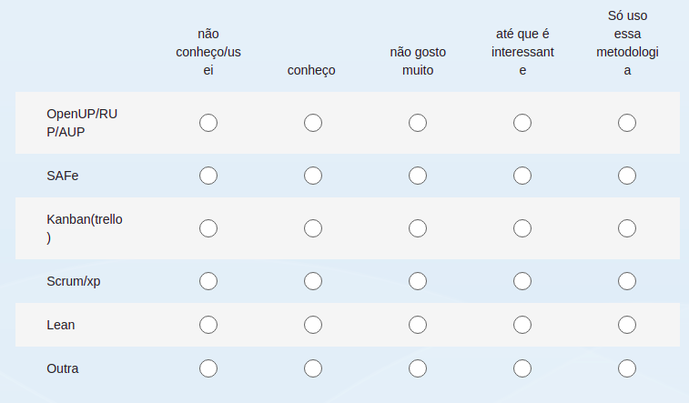

# 1.2. Módulo Processos/Metodologias/Abordagens

## Modelagem BPMN

### Introdução

BPMN (Business Process Model and Notation) é uma notação que permite modelar, descrever e documentar processos de negócios de diferentes níveis de complexidade e detalhamente. Foi desenvolvido com o objetivo dar suporte ao gerenciamento de processos através de representações gráficas, por meio de diagramas e um conjunto padronizado de símbolos e regras de notações intuitivas. O BPMN é uma linguagem popular e amplamente aceita entre as organizações para facilitar a compreensão, análise e comunicação dos processos de negócios.

### Detalhamento Metodológico

No dia 13 de abril, um formulário foi aberto para decidirmos sobre as metodologias e ferramentas que serão utilizadas no desenvolvimento desse projeto. 

Uma das perguntas feitas deste formulário era: **"Quais dessas metodologias você tem mais afinidade?"**

 

Com essa pesquisa obtivemos o seguinte resultado:

Metodologias: *ScrumXp & Kanban*

* **ScrumXp:** Scrum e XP fazem parte das escolhas metodológicas feitas pela equipe de acordo com o que podem oferecer e com as metas definidas, considerando que são metodologias ágeis que focam na comunicação, na produtividade e numa boa cooperação entre a equipe se encaixam nos propósitos requisitados para o projeto. Uma das principais caracteristicas da scrum é ser escalável tanto para processos grandes quanto pequenos que é o nosso caso e foi fundamentada baseada em um manifesto ágil assim como o XP que tem em seus princípios a simplicidade e as constantes mudanças, entregas e feedbacks. O scrum não depende de uma área de conhecimento para ser aplicada e trás mudanças principalmente comportamentais para a equipe já o XP é mais direcionado para o desenvolvimento de softwares e assim podemos garantir uma boa aplicação das duas metodologias.

* **Kanban:** Dentro do Scrum, iremos utilizar o *Quadro Kanban*, no qual temos alguns cartões que se deslocam pelo quadro. Esses cartões são as atividades que devem ser feitas para a conclusão do projeto, eles irão se locomover por três colunas diferentes: To do, Em desenvolvimento, Concluído.
A princípio o Product Backlog será as atividades que entraram na coluna *To do*, mas isso pode mudar de acordo com o andamento do projeto.
Na Sprint Backlog, é decidido quais atividades irão entrar no coluna *Em desenvolvimento*, que são as atividades que serão desenvolvidas durante a sprint. E na Sprint Review, é avaliado quais atividades foram completadas e podem ir para a última coluna *Concluído*.

### Modelagem BPMN & Justificativas

### Conclusão

### Escolhas Metodológicas

• ESCOLHA METODOLOGICA: 
    
      • PARTICIPANTE X
     
        ◦ : 
            
JUSTIFICATIVAS & SENSO CRÍTICO (ESCOLHA DA METODOLOGIA) 

#### Histórico de Versões

| Versão  |   Data   |                   Alteração                    |
| :-----: | :------: | :--------------------------------------------: |
|   1.0   | 18/04/23 | Explicação da metologia Kanban |

#### Referências

https://www.alura.com.br/artigos/metodo-kanban?gclid=Cj0KCQjwi46iBhDyARIsAE3nVraHWIzRKayS-buEfSkxp-nWSeBGHWlexGBrdr-oq_lsaTOiO87mFFgaAtTeEALw_wcB
