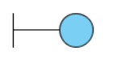

# 2.1.2. Notação UML – Diagramas Dinâmicos

## Modelagem UML Dinâmica

## Introdução

Diagramas UML dinâmicos, também conhecidos como comportamentais, são representações gráficas em forma de diagrama, utilizadas para descrever o comportamento em tempo de execução de um sistema, sobretudo por meio de interações entre objetos. Em geral eles enfocam aspectos como interações entre objetos, fluxo de mensagens, estados e atividades em um sistema.

Nesse sentido, os diagramas dinâmicos selecionados para o presente trabalho foram os **diagrama UML de atividades e de sequência**.

## Detalhamento Metodologico

A metodologia utilizada para a divisão do trabalho e a seleção dos diagramas a serem abordados, foi a utilização de enquetes no Whatsapp. Primeiro os integrantes foram divididos em subgrupos para a divisão de trabalhos, a divisão do grupo responsável pelos diagramas dinâmicos foi da seguinte maneira:

### Divisão do grupo
   

### Decisão do Diagrama

   

**Resultados**
- **Diagrama definido 1:** Diagrama UML de Atividades   
- **Participantes do subgrupo:** 
    * Ana Júlia Luziano Briceño
    * Eric Chagas de Oliveira
    * Wengel Rodrigues Farias
- **Diagrama definido 2:** Diagrama UML de sequência   
- **Participantes do subgrupo:**
  - * Daniel Rocha Oliveira
  - * Ingrid da Silva Carvalho

## Diagrama de Atividades

### O que é?

O diagrama UML dinâmico selecionado pela equipe foi o diagrama de atividades. ELe descreve o fluxo de atividades e comportamentos sequenciais em um sistema. Ele é usado para visualizar o comportamento dinâmico de um processo ou fluxo de trabalho, descrevendo a lógica sequencial das atividades e as decisões tomadas durante sua execução.

Esse tipo de diagrama é composto por nós, arestas e atividades. Os nós representam pontos no fluxo de atividades, como o início e o fim do processo, decisões, pontos de bifurcação ou junção. As arestas conectam os nós e indicam a sequência de fluxo entre as atividades. As atividades são representadas por retângulos e podem conter ações, chamadas a outros diagramas de atividades, decisões, eventos e sincronizações. Cada atividade descreve uma ação ou comportamento específico que ocorre no sistema.

Esses diagramas também são amplamente utilizados para modelar processos de negócios, fluxos de trabalho, algoritmos e qualquer sequência de atividades em um sistema. Eles permitem visualizar o fluxo lógico do sistema, identificar atividades paralelas, decisões e caminhos alternativos.

### Diagramas

Os padrões e simbolos utilizados foram os seguintes(Creately, 2022):

|                                                        Símbolo                                                         | Nome                                 | Descrição                                                                                         |
| :--------------------------------------------------------------------------------------------------------------------: | ------------------------------------ | ------------------------------------------------------------------------------------------------- |
|                                | Início/ Nódulo Inicial               | Usado para representar o ponto de partida ou o estado inicial de uma atividade                    |
|                  | Atividade / Estado de Ação           | Usado para representar as atividades do processo                                                  |
|                         | Ação                                 | Utilizado para representar as sub-áreas executáveis de uma atividade                              |
|       | Fluxo de controle / Borda            | Usado para representar o fluxo de controle de uma ação para a outra                               |
|         | Fluxo de objetos / Borda de controle | Usado para representar o caminho dos objetos que se movem através da atividade                    |
|      | Atividade final Node                 | Usado para marcar o fim de todos os fluxos de controle dentro da atividade                        |
|           | Fluxo final Nó                       | Usado para marcar o fim de um único fluxo de controle                                             |
|  | Nó de Decisão                        | Utilizado para representar um ponto de ramificação condicional com uma entrada e múltiplas saídas |
|  | Nó de mesclagem                      | Usado para representar a fusão de fluxos. Possui várias entradas, mas uma saída.                  |
|                          | Garfo                                | Usado para representar um fluxo que pode ramificar-se em dois ou mais fluxos paralelos            |
|                        | Fundir                               | Usado para representar duas entradas que se fundem em uma saída                                   |
|              | Envio de sinal                       | Usado para representar a ação de enviar um sinal para uma atividade de aceitação                  |
|             | Recibo de Sinal                      | Usado para representar que o sinal é recebido                                                     |
|           | Nota/ Comentário                     | Usado para adicionar comentários relevantes aos elementos                                         |

                                                                         
## Diagrama de Sequência

### O que é?

Um outro diagrama dinâmico escolhido foi o diagrama de sequência que evidencia a estrutura das mensagens trocadas que decorrem das  interações entre os objetos ao longo do tempo que ocorrem demonstrando a sequencia dos eventos comumente são baseados em diagramas de caso de uso. Considerado um diagrama complexo contém atores que representam usuários humanos ou outros elementos, os objetos caracterizando as instâncias das classes, as mensagens correspondem aos serviços solicitados de um objeto a outro e suas respectivas respostas, linhas de vida verticais divididas entre cabeça e calda, gates que são os pontos onde as mensagens podem ser propagadas para dentro ou para fora, dentre outros.

## Diagramas

Padrões e simbolos ultilizados no desenvolvimento do diagrama de sequência

|                                                        Símbolo                                                         | Nome                                 | Descrição                                                                                         |
| :--------------------------------------------------------------------------------------------------------------------: | ------------------------------------ | ------------------------------------------------------------------------------------------------- |
|                                | Autor               | Representa o autor ou usuário                    |
|                  | Ciclo de vida           | Usado para representar o período de tempo                                                  |
|                         | Mensagem                                 | Representa as trocas de solicitações efetuadas                              |
|       | Objeto            | Usado para representar as instancias das classes presentes no processo                               |
|         | Gate | Usado para representar pontos de transmissão de mensagens                    |
|      | Boundary                 | Usado para representar uma classe que é ultilizada para troca de informações entre agentes externos e o sistema                        |
|           | Control                       | Usado para representar a classe que estabelece a comunicação entre a boundary e outras classes                                             |
                                |

### Fluxos analisados

Os fluxos analisados e descritos nos diagramas de atividades são o de Cadastro e Login na plataforma do Mercado Livre, e de compra de produtos. Ambos os fluxos foram desenhados seguindo os padrões de diagramação UML dinâmica, do modelo de diagrama de atividades e do diagrama de sequencia, utilizando a ferramenta [Lucid Chart](https://www.lucidchart.com/pages/pt).

#### Fluxo de cadastro/login

   

#### Fluxo de compra

  

#### Histórico de Versões

| Versão |   Data   |                                      Alteração                                       |
| :----: | :------: | :----------------------------------------------------------------------------------: |
|  1.0   | 13/05/23 | Descrição dos diagramas dinâmicos, metodologias e adição dos diagramas de atividades |
|  2.0   | 14/05/23 | Inclusão do diagrama de esquemas |

 

#### Referências

  - Milene Serrano - Arquitetura e Desenho de software: Desenho de Software (Modelagem).
  - LUCIDCHART. O que é UML? Disponível em: https://www.lucidchart.com/pages/pt/o-que-e-uml. Acesso em: 13/05/2023.
  - CREATELY. Tutorial de diagrama de atividades. Disponível em: https://creately.com/blog/pt/diagrama/tutorial-de-diagrama-de-actividades/. Acesso em: 12/05/2023.

<!-- **Foco_02:** Modelagem UML Dinâmica

Entrega Mínina: 1 Modelo Dinâmico (ESCOPO: Diagrama de Sequência; Diagrama de Atividades; Diagrama de Estados ou Diagrama de Comunicação/Colaboração).

Apresentação (em sala) explicando o modelo dinâmico especificado, com: (i) rastro claro aos membros participantes (MOSTRAR QUADRO DE PARTICIPAÇÕES); (ii) justificativas & senso crítico sobre o modelo; (iii) breve apresentação do modelo dinâmico elaborado, e (iv) comentários gerais sobre o trabalho em equipe. Tempo da Apresentação: +/- 10min. Recomendação: Apresentar diretamente via Wiki ou GitPages do Projeto.

A Wiki ou GitPages do Projeto deve conter um tópico dedicado ao Módulo Notação UML – Diagrama Dinâmico, com 1 modelo, histórico de versões, referências, e demais detalhamentos gerados pela equipe nesse escopo. -->
