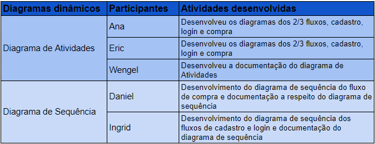
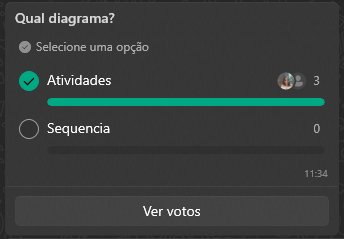
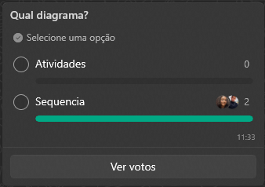

# 2.1. Módulo Projeto Orientado a Abordagens Tradicionais

## Metodologia de Divisão dos Grupos

* Para a criação dos diagramas de modelagem e execução dos artefatos...
## Diagramas Estáticos

* Os diagramas estáticos gerados podem ser encontrados na seção 

## Diagramas Dinâmicos

A metodologia utilizada para a divisão do trabalho e a seleção dos diagramas a serem abordados, foi a utilização de enquetes no Whatsapp. Primeiro os integrantes foram divididos em subgrupos para a divisão de trabalhos, a divisão do grupo responsável pelos diagramas dinâmicos foi de acordo com a figura divisão de grupos.
   

   
 
   