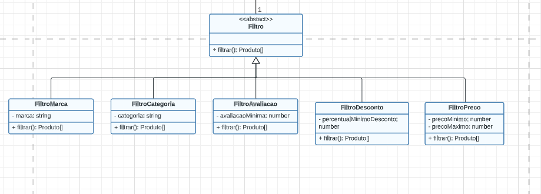
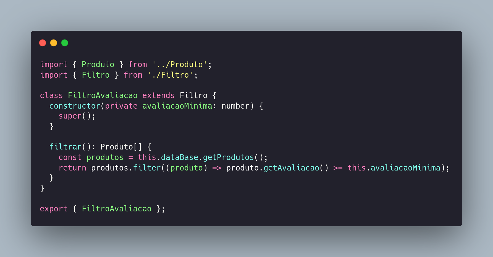
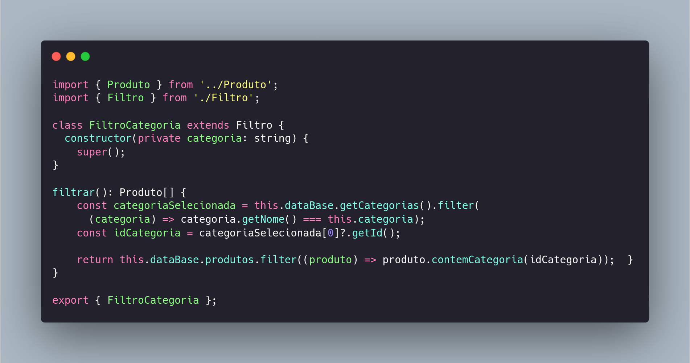
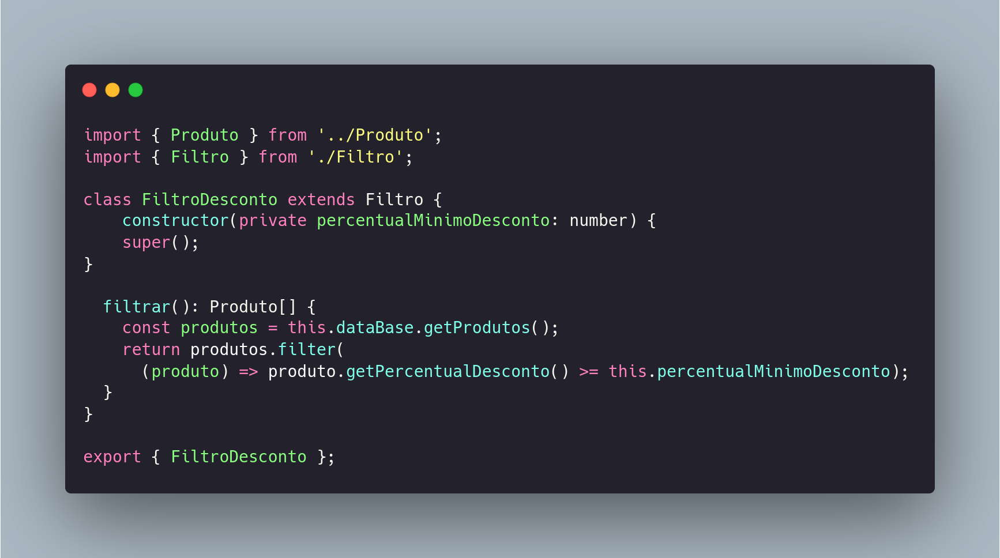
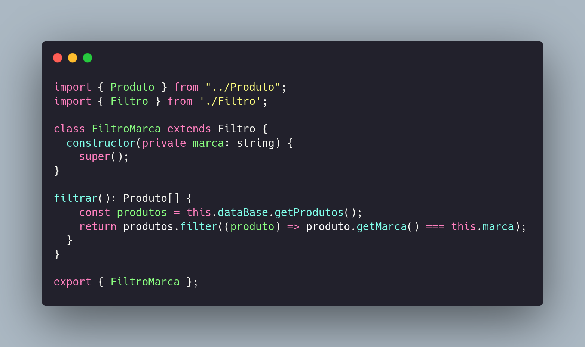
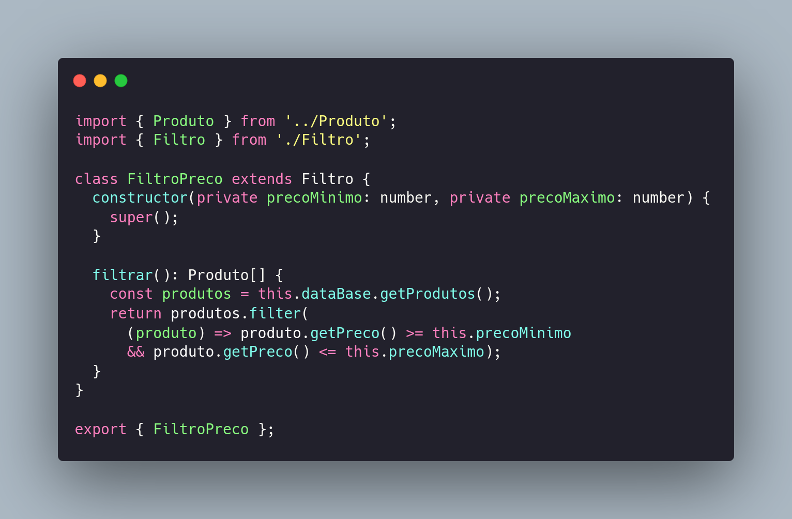

# GRASPS - Fluxo de Pagamento e Filtros

## Polimorfismo

### Contexto
No contexto do GRASP, uma vantagem do polimorfismo é que ele permite atribuir responsabilidades a abstrações, em vez de objetos concretos. Isso significa que as classes podem ser projetadas para serem intercambiáveis, permitindo que diferentes implementações possam ser usadas de acordo com as necessidades do sistema.

Essa flexibilidade oferecida pelo polimorfismo permite que o código seja mais adaptável a mudanças futuras. Quando as responsabilidades são atribuídas a abstrações, é possível substituir ou adicionar novas implementações sem alterar o restante do código. Isso resulta em um sistema mais modular, de fácil manutenção e com menor acoplamento.

Além disso, o polimorfismo promove a reutilização de código e a extensibilidade do sistema. As abstrações podem ser estendidas para criar novas classes que compartilham comportamentos comuns, evitando a duplicação de código e aumentando a eficiência do desenvolvimento.

Em resumo, o polimorfismo, dentro do contexto do GRASP, oferece a vantagem de permitir que as responsabilidades sejam atribuídas a abstrações, tornando o sistema mais flexível, adaptável a mudanças futuras e promovendo a reutilização de código.

### Vantagens
- Flexibilidade
- Extensibilidade
- Reutilização de código
- Modularidade
- Melhor testabilidade

### Modelagem - Fluxo de Pagamento

<figcaption align="center" >Figura 1 - GoF Strategy Pagamento (parte). Fonte: Autores </figcaption>

 
 

<figcaption align="center" >Figura 2 - Código da classe PagamentoCredito (parte). Fonte: Autores </figcaption>

 
 

<figcaption align="center" >Figura 3 - Código da classe PagamentoBoleto (parte). Fonte: Autores </figcaption>

 
 

<figcaption align="center" >Figura 4 - Código da classe PagamentoDebitoCaixa (parte). Fonte: Autores </figcaption>

 
 

<figcaption align="center" >Figura 5 - Código da classe PagamentoPix (parte). Fonte: Autores </figcaption>

 
 

### Descrição - Fluxo de Pagamento
O GRASP polimorfismo foi utilizado na herança da FormaDePagamento em PagamentoCartaoCredito, PagamentoPix, PagamentoDebitoCaixa e PagamentoBoleto, as quatro especializações possuindo funcionalidades diferentes no projeto. Na Figura 1 é apresentada essa diagramação, enquanto nas figuras 2, 3, 4 e 5, sua implementação.

### Modelagem - Filtros

**Modelagem das classes de filtro com polimorfismo e herança**

As possibilidades de filtro exploradas na plataforma do Mercado Livre, como evidenciado na modelagem acima, foram de filtro por marca, categoria, avaliação, desconto e preço de produto. Foi desenhada uma classe base chamada Filtro, que possui a responsabilidade apenas de realizar filtragem. 

Dessa classe geral, herdam as subclasses de filtro específicas para cada contexto e cada uma possui uma implementação distinta para método filtrar, que herdam da classe Filtro.

#### Classe Filtro

#### Classe Filtro por Avaliação

#### Classe Filtro por Categoria

#### Classe Filtro por Desconto

#### Classe Filtro por Marca

#### Classe Filtro por Preço

 

### Descrição - Filtros
Dentre os conceitos e padrões aplicados no GRASP, o polimorfismo é um dos métodos mais eficazes de manter a coesão entre as classes implementadas no projeto, e de manter as responsabilidades de cada uma bem definidas e equilibradas.

O polimorfismo é um conceito essencial na programação orientada a objetos, no sentido de que tem um papel muito importante da redução de código redundante e principalmente nas abstrações de regras de negócio por meio da construção das classes e da utilização de herança entre elas.

No contexto do fluxo de listagem de produtos no Mercado Livre, uma forte candidata à aplicação de polimorfismo é a funcionalidade de filtragem dos produtos. Isso se deve à possibilidade de aplicar filtros com diferentes parâmetros, como nome do produto, categoria do produto, limite de preço, entre outros.

Nesse sentido, é visível que a classe de filtros, responsável por realizar todas essas operações na lista de produtos, e que naturalmente seria sobrecarregada com diversos métodos de filtragem para cada um desses parâmetros de pesquisa, pode ser implementada como uma abstração (ou uma classe base), responsável apenas por filtrar, e relacionada a várias subclasses que herdam dela e possuem implementações específicas para a filtragem, de acordo com seu escopo.

## Referências

- Milene Serrano - Arquitetura e Desenho de software: GRASP Criador, GRASP Especialista e demais GRASPs.

- Padrões GRASP — Padrões de Atribuir Responsabilidades - https://medium.com/@leandrovboas/padr%C3%B5es-grasp-padr%C3%B5es-de-atribuir-responsabilidades-1ae4351eb204 

- Uso de Polimorfismo em Java - https://www.devmedia.com.br/uso-de-polimorfismo-em-java/26140#:~:text=Polimorfismo%20significa%20%22muitas%20formas%22%2C,mesmo%20elemento%20de%20formas%20diferentes. 
 

### Histórico de Versões

| Versão  |   Data   |                   Alteração                    | Participantes |
| :-----: | :------: | :--------------------------------------------: | :-----------: |
| 1.0     | 11/06   | Criação do documento e participantes           | Bruna Lima |
| 2.0     | 11/06   | Atualização do documento GRASP Polimorfismo          | Giulia |