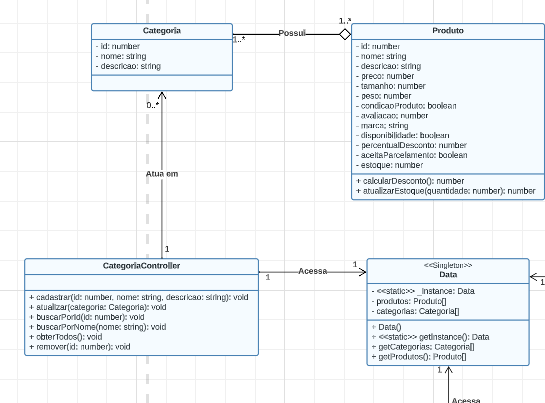
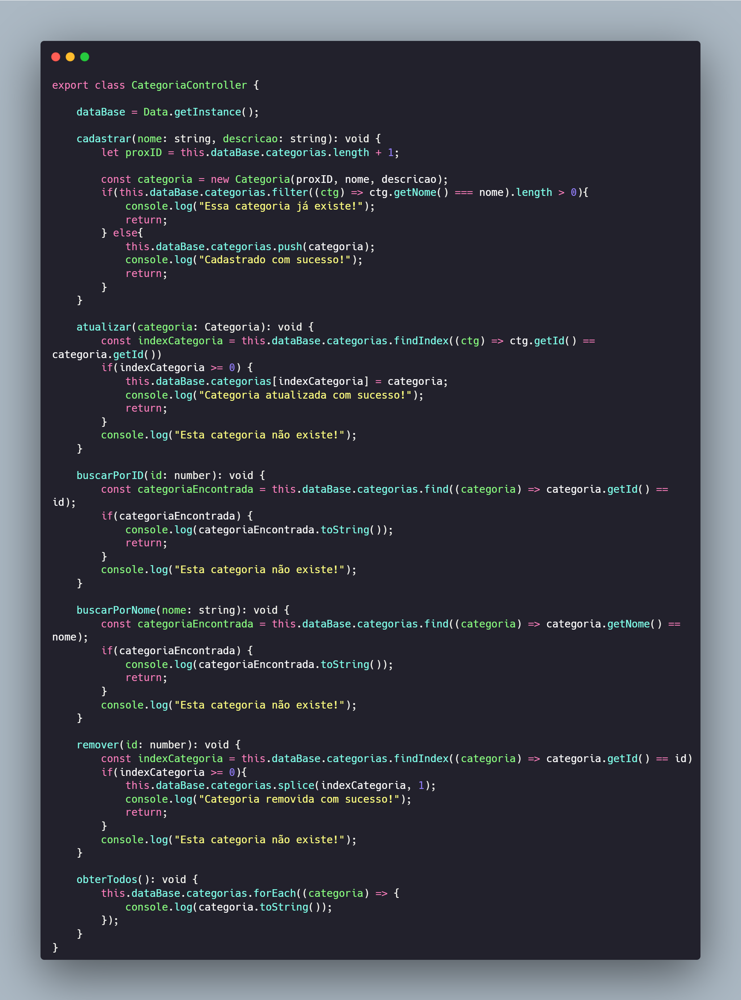

## GRASP Controller
### Contexto

Grasp controller se refere a um componente ou módulo que controla a lógica de negócios relacionada à captura, processamento e manipulação de dados em um aplicativo ou sistema.
Por exemplo, em um sistema de gestão de produtos, um grasp controller seria responsável por receber os dados de entrada relacionados aos produtos em estoque, como quantidade, localização e status, e aplicar as regras de negócio necessárias para atualizar e manipular esses dados conforme as operações sejam realizadas, como vendas, reposição de estoque ou transferências entre locais.

### Modelagem

**Modelagem das classes controller com dependencia**

<figcaption align="center" >Figura 1 - exemplo de modelagem de categoria controller. Fonte: Autores </figcaption>

 
Categoria controller tem uma relação de dependencia comm data no caso o banco pois depende do banco para efetuar as operações de CRUD e também depende de categoria onde estão presentes os atributos.

Codigo mostrando a logica:

<figcaption align="center" >Figura 2 - Codigo elaborado de acordo com a modelagem. Fonte: Autores </figcaption>

 
Baseado na ideia de dependencia elaboramos o codigo da melhor forma possivel onde uma classe necessita utilizar metodos de outra classe o que categoriza a dependencia de fato.
É importante destacar que uma relação de dependência não implica em uma relação de posse ou propriedade. A dependência se refere apenas ao fato de que um elemento precisa do outro para funcionar corretamente, mas cada elemento pode existir independentemente.

### Descrição

O padrão Controller sugere que uma classe, chamada "Controller", seja responsável por receber e processar as solicitações do usuário, coordenar a interação entre as classes envolvidas e controlar o fluxo do sistema. O Controller é responsável por receber eventos, interpretá-los e tomar as medidas apropriadas.

Algumas características e responsabilidades do Controller incluem:

1 - Receber entrada do usuário: O Controller é o ponto de entrada para as solicitações do usuário, seja por meio de uma interface de usuário ou de outros sistemas.

2 - Coordenar a interação: Ele coordena a interação entre os objetos envolvidos em uma operação, atuando como um intermediário entre a interface de usuário e o restante do sistema.

3 - Gerenciar fluxo de controle: O Controller é responsável por gerenciar o fluxo de controle, decidindo quais ações e operações devem ser executadas em resposta a eventos e solicitações.

4 - Orquestrar operações: Ele orquestra a execução de operações complexas envolvendo várias classes e objetos, garantindo que a interação ocorra corretamente.

5 - Realizar validações e tomada de decisão: O Controller pode realizar validações de entrada, tomar decisões com base nas solicitações recebidas e direcionar o fluxo do sistema de acordo.

O objetivo do padrão Controller é manter as classes e objetos focados em suas responsabilidades principais, garantindo que a lógica de coordenação e controle esteja centralizada em uma classe dedicada.

 