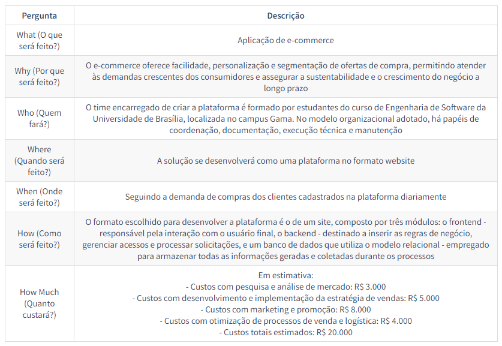

# Projeto Mercado Livre (2023.1)

**Código da Disciplina**: FGA0208 
**Número do Grupo**: 01 

## Alunos
|Matrícula | Aluno |
| -- | -- |
| 18/0097504  |  Ana Júlia Luziano Briceño |
| 20/2015984  |  Breno Henrique de Souza |
| 21/1041105  |  Bruna de Lima Santos |
| 19/0104821  |  Daniel Rocha Oliveira |
| 18/0119508  |  Eric Chagas de Oliveira |
| 18/0121308  |  Giulia Domingues de Alcantara |
| 19/0108088  |  Guilherme França Dib de Oliveira Bessa |
| 18/0121847  |  Helder Lourenço de Abreu Marques |
| 19/0029731  |  Ingrid da Silva Carvalho |
| 19/0015721  |  Julio Cesar Martins Franca |
| 19/0118555  |  Wengel Rodrigues Farias |

## Sobre 
- Mercado Livre: perfil comprador e fluxos compreendidos - do cadastro na plataforma a visualização/compra/pagamento de produtos.

## DSW (Base)

### 5W2H

### Escolha da Metodologia - Modelagem BPMN
 

## DSW (Modelagem)
Adicione 2 ou mais screenshots em termos de artefatos da Segunda Entrega.

## DSW (Padrões de Projeto)
Adicione 2 ou mais screenshots em termos de artefatos da Terceira Entrega.

## Arquitetura & Reutilização de Software & PROJETO FINAL
Adicione 2 ou mais screenshots em termos de artefatos da Quarta Entrega.

## Descritivo dos Principais Aspectos Técnicos 
**Principal(is) Metodologia(s) Adotada(s)**: Scrum, XP, Kanbam, 5W2H, Mapa Mental 
**Principais Linguagens Utilizadas e/ou Pretendidas**: TypeScript, JavaScript, React, MySQL 
**Principais Tecnologias Utilizadas e/ou Pretendidas**: NestJS, NodeJS, Figma 
**Principal(is) Estilo(s) Arquitetural(is) Adotado(s)**: xxxxxx 

## Há algo a ser executado?

( ) SIM

( ) NÃO

Se SIM, insira um manual (ou um script) para auxiliar ainda mais os interessados na execução.

## Informações Complementares 
Quaisquer outras informações adicionais podem ser descritas nessa seção.
