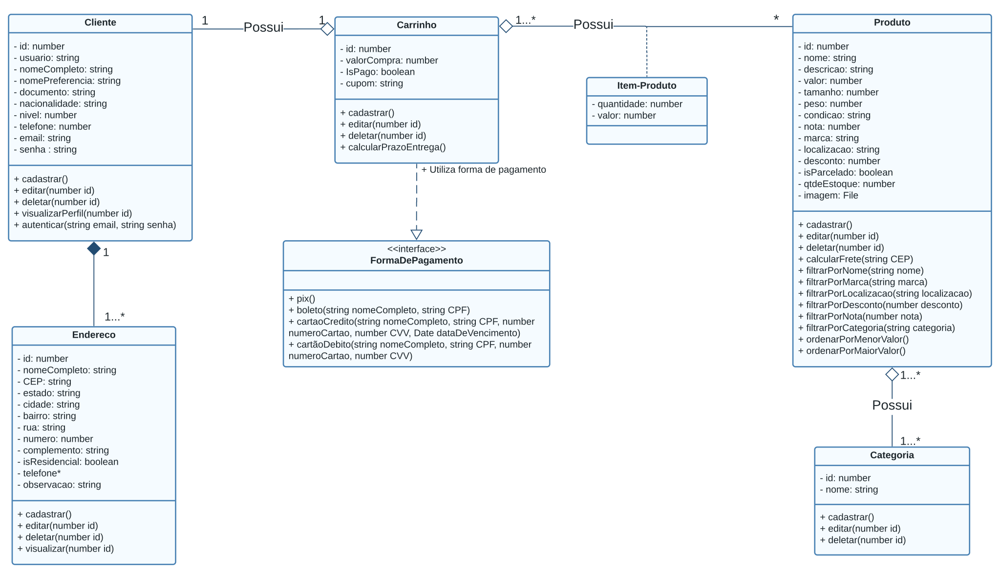
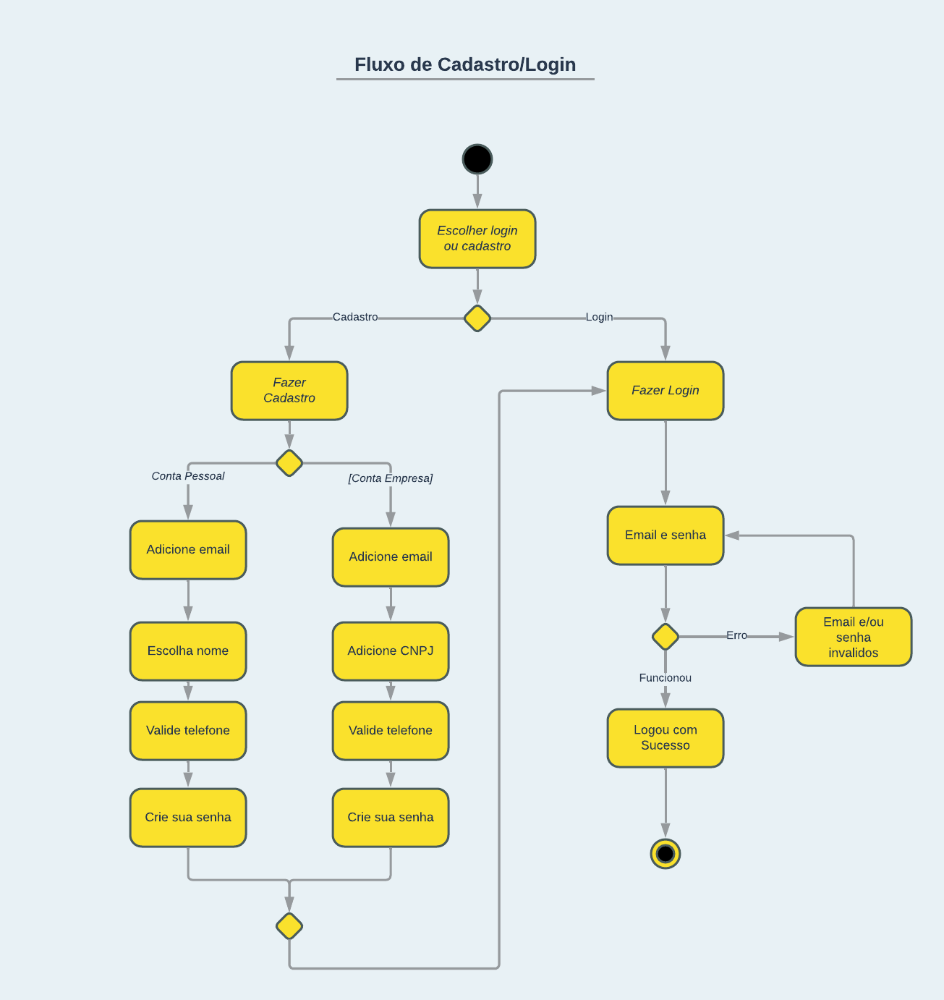
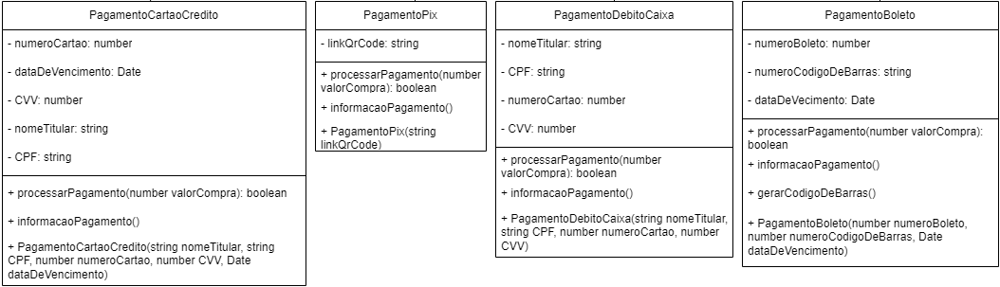
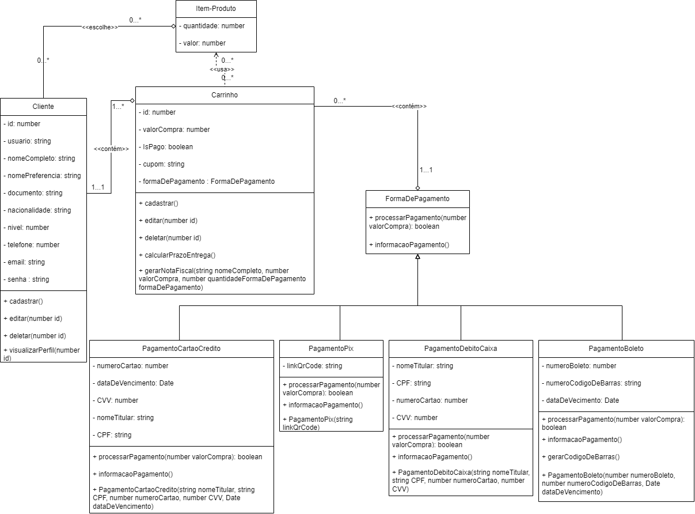
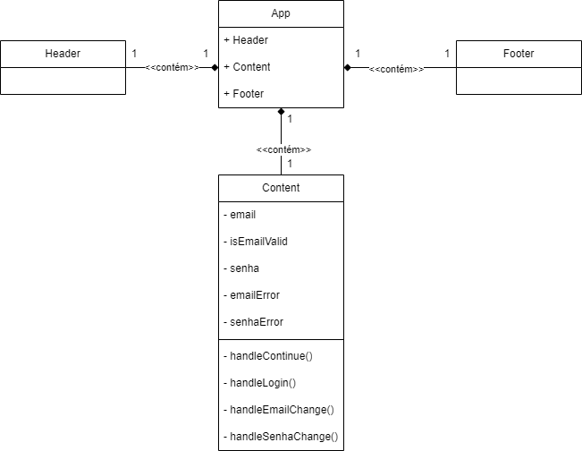
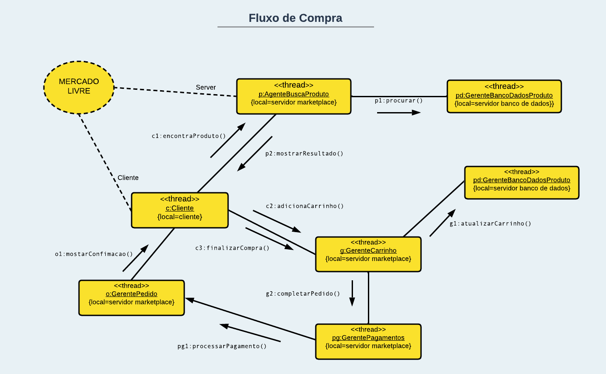

# Projeto Mercado Livre (2023.1)

**Código da Disciplina**: FGA0208 
**Número do Grupo**: 01 

## Alunos
|Matrícula | Aluno |
| -- | -- |
| 18/0097504  |  Ana Júlia Luziano Briceño |
| 20/2015984  |  Breno Henrique de Souza |
| 21/1041105  |  Bruna de Lima Santos |
| 19/0104821  |  Daniel Rocha Oliveira |
| 18/0119508  |  Eric Chagas de Oliveira |
| 18/0121308  |  Giulia Domingues de Alcantara |
| 19/0108088  |  Guilherme França Dib de Oliveira Bessa |
| 18/0121847  |  Helder Lourenço de Abreu Marques |
| 19/0029731  |  Ingrid da Silva Carvalho |
| 19/0015721  |  Julio Cesar Martins Franca |
| 19/0118555  |  Wengel Rodrigues Farias |

## Sobre 
- Mercado Livre: perfil comprador e fluxos compreendidos - do cadastro na plataforma a visualização/compra/pagamento de produtos.

## DSW (Base)

### 5W2H

### Escolha da Metodologia - Modelagem BPMN
 

## DSW (Modelagem)

### Diagrama Estático - Diagrama de Classes

 

### Diagrama Dinâmico - Diagrama de Atividades 

 

## DSW (Padrões de Projeto)

### Padrão GRASP - Alta Coesão 
 

### Padrão GoF - Strategy
 

### Padrão Emergente - React Component
 

## Arquitetura & Reutilização de Software & PROJETO FINAL

### Visão de Processos

### Visão de Implantação

